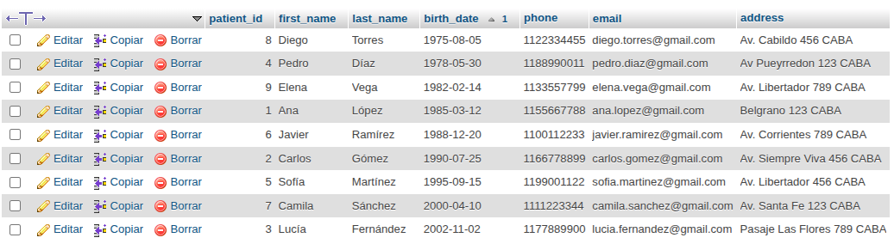
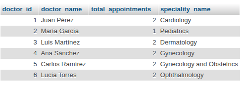
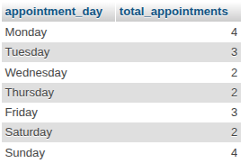
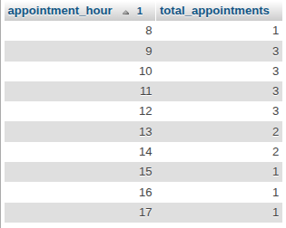

# Clinic Scheduler Project

## Project Objective

This project aims to design and implement a relational database for managing medical appointments in a clinic. The system allows you to store and organize information about specialties, doctors, patients, rooms, and appointments, enabling efficient scheduling, tracking, and analysis of clinic activity.

## Folder Structure

```
/clinic-scheduler-project/
│
├── create_table.sql   # Table creation script
├── insert_data.sql    # Sample data insertion script
├── queries.sql        # Key queries for management and analysis
├── modelo_ER.png      # Entity-Relationship diagram (to be added)
└── README.md          # Project documentation
```

## Scripts

- **create_table.sql**  
  Creates all tables required for the clinic scheduler database, including primary keys, foreign keys, and constraints for:

  - Specialties
  - Doctors
  - Patients
  - Rooms
  - Appointments

- **insert_data.sql**  
  Inserts sample records into each table, providing realistic data for specialties, doctors, patients, rooms, and appointments. This allows you to test and explore the database with meaningful examples.

- **queries.sql**  
  Contains a collection of useful SQL queries to:
  - List and organize patients, doctors, and appointments
  - Monitor appointment status (scheduled, completed, cancelled)
  - Analyze trends (peak hours, most requested specialties, cancellations)
  - Support clinic management and reporting

## How to Use

1. **Create the database**  
   Start by creating your database in MySQL, for example:

   ```sql
   CREATE DATABASE clinic_scheduler_db;
   USE clinic_scheduler_db;
   ```

2. **Run `create_table.sql`**  
   Set up the database schema by creating all tables.

3. **Run `insert_data.sql`**  
   Populate the tables with sample data.

4. **Run `queries.sql`**  
   Execute the queries to manage, monitor, and analyze clinic activity.

## Running with XAMPP and phpMyAdmin

You can run this project entirely on the MySQL server included with XAMPP.

**Steps:**

1. **Start XAMPP services**

   - Open the XAMPP Control Panel.
   - Start the MySQL service (required).
   - Start Apache only if you plan to use phpMyAdmin.

2. **Connect from your SQL client (VS Code extension, DBeaver, etc.)**

   - Create a new connection with these settings:
     - Host: `localhost`
     - Port: `3306`
     - User: `root`
     - Password: _(leave blank if using default)_
   - This connects to the same MySQL server used by phpMyAdmin.

3. **Create and populate the database**

   - From your SQL client:
     - Create the database:
       ```sql
       CREATE DATABASE clinic_scheduler_db;
       USE clinic_scheduler_db;
       ```
     - Run `create_table.sql` to set up the schema.
     - Run `insert_data.sql` to insert sample data.

4. **View and manage data in phpMyAdmin**
   - Open your browser and go to [http://localhost/phpmyadmin](http://localhost/phpmyadmin).
   - You will see the `clinic_scheduler_db` database with all tables and data created from your SQL client.
   - From phpMyAdmin, you can:
     - Browse tables and data visually
     - Run SQL queries
     - Export or import data
     - Perform administrative tasks

**Tip:**  
Any changes you make in VS Code (or your SQL client) will be instantly reflected in phpMyAdmin, since both connect to the same MySQL server.

Example:

## Example Query Results in phpMyAdmin

Below are examples of how the main queries look when executed in phpMyAdmin:

### 1. List of all patients ordered by birth date



### 2. List scheduled appointments for each doctor and their specialty



### 3. List specialties with the most cancelled appointments per month


### 4. Peak days of the week for scheduled appointments



### 5. Peak hours for scheduled appointments



## Author

Camila Villalba Heuer  
[LinkedIn](https://www.linkedin.com/in/camilavheuer)  
cbvillalbaheuer@gmail.com
